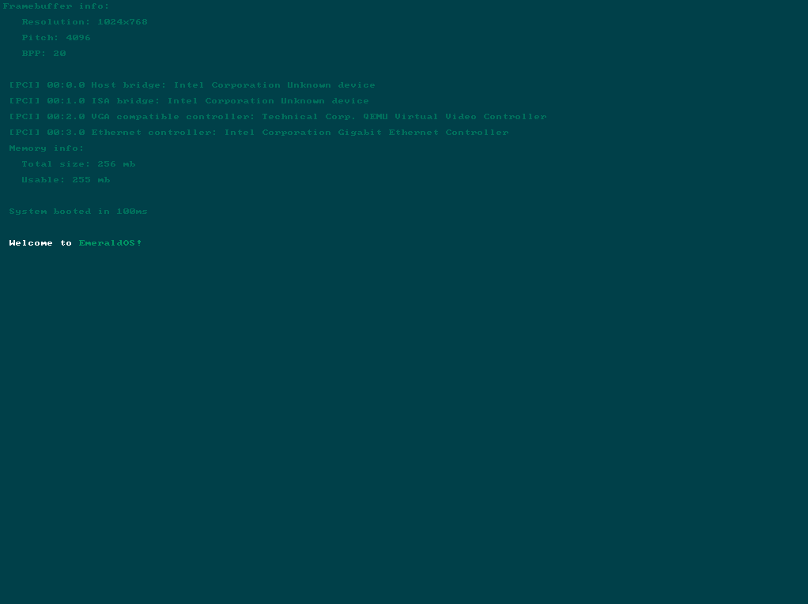

 An operating system kernel written for fun in C

## ⚙️ How to build

Please look at the [Build guide](https://github.com/Abb1x/emerald/blob/master/docs/build-guide.md)
### Prebuilt images
You can use prebuilt .hdd images in the releases tab, I suggest you run them using qemu
## :heavy_check_mark: TODO

- [ ] Fix VMM
- [ ] Multitasking
- [ ] EXT2 filesystem
- [ ] Userspace
- [ ] Port libc
- [ ] AHCI/Sata (would be nice)
- [ ] Reading from disk (goes with sata)
- [ ] Implement a font parser (PSF or TTF)
- [x] Rewrite

### Screenshots

